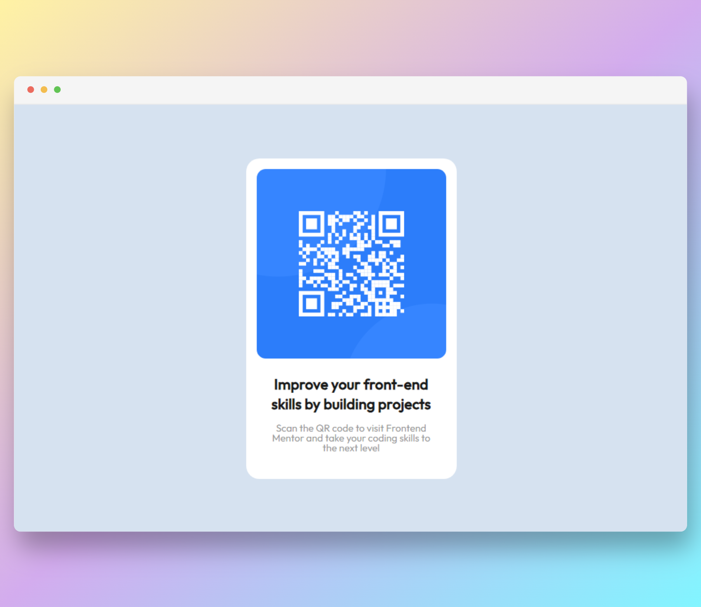

# QR code component solution

This is a solution to the [QR code component challenge on Frontend Mentor](https://www.frontendmentor.io/challenges/qr-code-component-iux_sIO_H).

### Screenshot

### Links

- [Solution URL](https://www.frontendmentor.io/solutions/qr-code-component-using-both-flexbox-and-grid-layout-TCoNEVXJ5g)
- [Live Site URL](https://rtlsalazar.github.io/card-layout--qr-component/dist/index.html)

### Built with

- Semantic HTML5 markup
- Flexbox
- CSS Grid

test